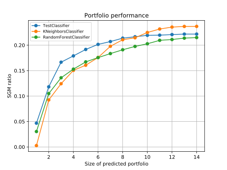
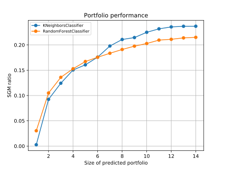

.. _tutorials-ref:

Tutorials
=========

Package configuration
---------------------
All package parameters are controlled by package's configuration module and purpose
of this tutorial is to show you how to customize those parameters. We strongly
suggest you to go through this chapter, but even if you decide to skip it, that won't
be a problem in most cases, because all configuration parameters already have
default values that you can see here (TODO link to the table with default values).

Set configuration programmatically
^^^^^^^^^^^^^^^^^^^^^^^^^^^^^^^^^^
Following code snippet shows example code for modifying some parameters of default
configuration. ::

  from predictor import config

  # just shorter way to reference package configuration object
  cfg = config.global_config

  # set some parameters, their meaning is not relevant right now...
  cfg.set_parameter('alpha_pdi', 1000)
  cfg.set_parameter('actual_pdi_data_fullpath', '/home/gorana/actual_data/mipdev_pdi_data.csv')
  cfg.set_parameter('predicted_data_dir', '/home/gorana/predicted_data/')
  cfg.set_parameter('plot_data_dir', '/home/gorana/plots')

  # print configuration
  print(cfg)

By printing configuration at this point, you should see that previously mentioned
four parameters are set to new values, while all others have their default values.
If you wish to save the custom configuration that you have made you can always do that
by calling configuration serialization method :py:meth:`~predictor.config.Config.save_to_file`.

.. hint:: This way of configuring is particularly good for changing parameter
   values "on the fly" while you use other modules from this package.

Load configuration from file
^^^^^^^^^^^^^^^^^^^^^^^^^^^^
Since this package has a lot of parameters that you might want to change and keep
for later use, you can also load parameter values from a configuration file.
Configuration file has to be written in YAML format. Here you can see a content
of an example configuration file::

  alpha_pdi: 1000
  actual_pdi_data_fullpath: '/home/gorana/actual_data/mipdev_pdi_data.csv'
  predicted_data_dir: '/home/gorana/predicted_data/'
  plot_data_dir: '/home/gorana/plots'

Using configuration file, you can set values for some configuration parameters,
but not necessary for all of them. The parameter for which value is not found in
the configuration file will keep its current value. In order to set configuration
according to the configuration file, you should take a look at following code snippet::

    from predictor import config

    # just shorter way to reference package configuration object
    cfg = config.global_config

    # loads configuration from file
    cfg.load_from_file('path/to/configuration/file')

    # print configuration
    print(cfg)

At this point, output for all four parameters from configuration file should be
exactly the same as the output of example in the previous section.

.. hint:: This way of configuring is particularly good for setting large number
   of parameter values, which makes it good for setting initial configuration.

Investigate features
--------------------
If you want to analyze instance features, you should use :py:mod:`feature_investigator`
module. Using this module, you can investigate correlations between the features,
explore dimensionality of the feature space using PCA and MDS statistical analysis
techniques and find most important features in the sense of random regression forest
analysis. Here is code example of performing correlation analysis::

    from predictor.feature_investigator import correlations as fi

    fi.investigate('path/to/feature/file.csv')

In case that you want to use PCA instead of the correlations, it should be enough
to replace ``correlations`` with ``pca`` in the import statement.

Train classifiers
-----------------
In order to train any classifier, you will need a set of solved problem instances.
More precisely, for each problem instance, you need values for the instance's features
and performance metric (time needed for instance to be solved or value of
primal-dual integral). All Algorithm Predictor's classifiers expect you to provide
that data in form of two CSV files, where the first column contains problem instance
names and the first row feature names or algorithm names, for features or performance
files respectively. Here is an example of how to train a classifier using HYDRA
boosting technique::

    from predictor.models import hydra as classifier

    classifier.train('path/to/feature/file.csv', 'path/to/performance/file.csv')

.. warning:: You should check classifier documentation in more detail when
  switching between classifiers. Some classifiers might have extra methods that should
  be called before training to improve classifier's efficiency. Also, number of
  mandatory parameters for training function might not be the same for all classifiers.

Measure performance of trained classifiers
------------------------------------------
Each classifier outputs at least one CSV file with algorithm ranking for each
instance in a test set. In order to measure classifier's accuracy, you can use
:py:meth:`~predictor.performance.measurement.measure_performance` function for
just one, or :py:meth:`~predictor.performance.measurement.measure_performance_multiple_files`
function of :py:mod:`~predictor.performance.measurement` module for multiple files.

Let's say that we have two classifiers output files named ``KNeighborsClassifier_s0.csv``
and ``RandomForestClassifier_s0.csv``. If you want to check how well random
forest classifier ranked algorithms for the instances in the test set, you would do that
like this::

    from predictor.performance import measurement

    measurement.measure_performance(
        actual_data_type = 'pdi',
        predicted_data_filename = 'RandomForestClassifier_s0.csv'
    )

In this case, we wanted to use values of primal-dual integral to evaluate results
stored in ``RandomForestClassifier_s0.csv`` file. Notice that there is possibility
to specify name of the result file only, but not the whole path to the file. That means
that file with results should be placed on location pointed by
:py:attr:`~predictor.config.Config.predicted_data_dir` configuration parameter
before running this method. By default, this method will try to calculate performance
metric for every number of algorithms in the portfolio.
For example, if some classifier has given you the prediction of ranking for 14
algorithms for some instance, by default this method will return a list of 14
values where first value stands for performance metric for just first algorithm in
portfolio, second for first two algorithms in the portfolio and so on. For more
details about all parameters for this function, see API documentation.

Let's consider another scenario where you have files ``RandomForestClassifier_s0.csv``,
``RandomForestClassifier_s1.csv`` and ``RandomForestClassifier_s3.csv``, which
are produced by same classifier ran multiple times with different seeds. If you want
to evaluate some classifier according to all result files it produced for different
seeds, you would use :py:meth:`~predictor.performance.measurement.measure_performance_multiple_files`
function like this::

    from predictor.performance import measurement

    measurement.measure_performance_multiple_files(
        actual_data_type = 'pdi',
        file_regexs = ['RandomForestClassifier*.csv']
    )

Like in the previous case, all three files should be stored on location pointed by
:py:attr:`~predictor.config.Config.predicted_data_dir` configuration parameter.

Both functions result in a file containing the performance value for each number
of algorithms in portfolio, as well as standard deviation and standard error values.
Resulting file with name ``RandomForestClassifier.pdat`` will be saved at location
pointed by :py:attr:`~predictor.config.Config.plot_data_dir` configuration parameter.

Create plots
------------

At this point, you might have a bunch of '.pdat' files produced by different classifiers.
Nice way to find out which classifier suites your needs the best is to plot their
performance that you have calculated in the previous step and compare them.

To do that, you can use :py:class:`~predictor.performance.visualisation.plotter.Plotter`
class. Currently, this class has two functions meant to be used for plotting:
:py:meth:`~predictor.performance.visualisation.plotter.Plotter.plot_performance` and
:py:meth:`~predictor.performance.visualisation.plotter.Plotter.plot_error_bars`.
If you want to be sure that methods will work as expected, you should make sure
that all data needed for plotting is located in directory pointed by
:py:attr:`~predictor.config.Config.plot_data_dir` configuration parameter. That
includes files that contain data about curves that will be plotted (files with
.pdat extension, one file is one curve) and a file containing a list of curves that
will be plotted. Where produced plots will be saved is determined by
:py:attr:`~predictor.config.Config.plots_dir` configuration parameter.

.. code::

  from predictor import config
  from predictor.performance.visualisation import plotter

  # just shorter way to reference package configuration object
  cfg = config.global_config

  # if you don't set plot_data_dir, it will point to the $ROOT_DIR/data/performance/plot_data
  # (of course, if you didn't change that in some previous time point)
  cfg.set_parameter('plot_data_dir', '/home/gorana/plot_data')

  # if you don't set plots_dir, it will point to the $ROOT_DIR/data/performance/plots
  # (of course, if you didn't change that in some previous time point)
  cfg.set_parameter('plots_dir', '/home/gorana/plots')

  p = plotter.Plotter()

  # plot performance data (array of y values from .pdat file)
  # for curves specified in file `custom_plot_list_name.yml`
  p.plot_performance(plots_list_filename = 'custom_plot_list_name')

In this case, function will try to find the file named ``custom_plot_list_name.yml``
(notice that you don't have to yourself append the extension), open it and read
names of all `.pdat` files it should plot. Then all data from files specified will
be loaded and plotted. You could have called this method even without any arguments
in which case it would search for a file named ``plots_list.yml``. It is possible
to plot variance on the plot produced by this method. For more details, see API
documentation for :py:meth:`~predictor.performance.visualisation.plotter.Plotter.plot_performance`.

.. _fig1:

  *Example plot for curves representing three classifiers.*

There is one very important parameter of :py:meth:`~predictor.performance.visualisation.plotter.Plotter.plot_performance`
function named `plot_best_curves`. You can assign it a list of numbers between 1 and
a total number of algorithms to control which curves will be plotted. For example,
if you assign it with ``range(1,8)`` function will for each number of algorithms
in portfolio (from 1 including 7) find the curve with minimal y value at that point
and plot just that curve. On :numref:`fig2` is shown subset of curves from :numref:`fig1`
generated by calling ``plot_performance`` with ``plot_best_curves = range(1,8)``.
As you can see, in :numref:`fig2` curve for TestClassifier is omitted because
that curve has no minimal y value for none of the first seven algorithm portfolios.

.. _fig2:

  *After choosing just best curves*

Use classifiers to predict ranking
----------------------------------
Not implemented
